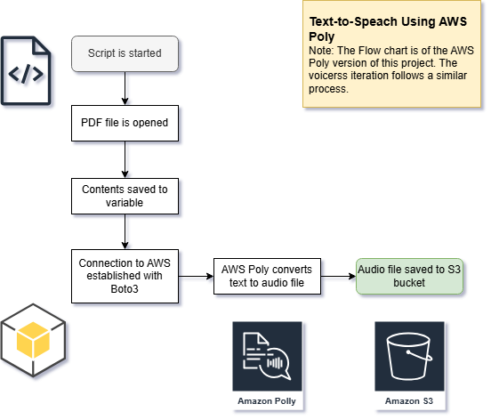

# 100 Days of Code Day 83: Portfolio Website

*Note: This documentation focuses more on the AWS Polly iteration of this project. Voice RSS was initially used, but had limitations that technically fulfilled the requirements for this project, but left more to be desired.*
## Technologies Used
### AWS Polly
**AWS Polly** is used to convert the text extracted from the PDF files and generate an audio file to be saved in an S3 bucket.
### AWS S3
**AWS S3** is used to store the audio files that are generated from the uploaded text.
## Modules Used
### Os & dotenv
**Os** and **dotenv** are used to access environment variables.
### PyPDF2
The **PyPDF2** module is used to read the PDF files used in this project.
### Boto3
**Boto3** is used to connect to AWS and interact with the AWS services used in this project.
## Project Files
### Text-Files Folder & PDF files
The PDF  files uploaded in this folder were used to test the text-to-speech (TTS) solution being used.
### Tts_with_polly.py
This file is the project version that uses **AWS Polly** and **S3** for creating audio files and saving them in a storage location.
### Tts_with_voicerss.py
This file is the project version using the Voice RSS for TTS conversions.
## Project Walkthrough
### Voice RSS Version

I initially wanted to use **Voice RSS** for this project due to it being a free service that did not require credit card information. However, the platform ran into issues when uploading longer text files for conversion. 

The script first starts by uploading the extracted text to the Voice RSS endpoint. The audio file that is generated is accessed at the response URL that is output once the script is finished running. 

For anyone wanting to use the Voice RSS service for TTS, the service can be found [here](https://voicerss.org/).
### AWS Polly Version
The TTS script first starts by extracting the text from the PDF file that is being passed through. This text is saved to a variable that will be accessed by AWS Polly to create the audio file.

Once the text is extracted, **boto3** is used to connect to **AWS Polly** and generate an audio file from the data saved in the variable generated in the previous step. 

One of the response values that is passed through is the S3 storage location to save the audio files. After executing the script, the audio files can be found in the specified S3 bucket as depicted in the screenshot at the top of this document.

## Project Flowchart
